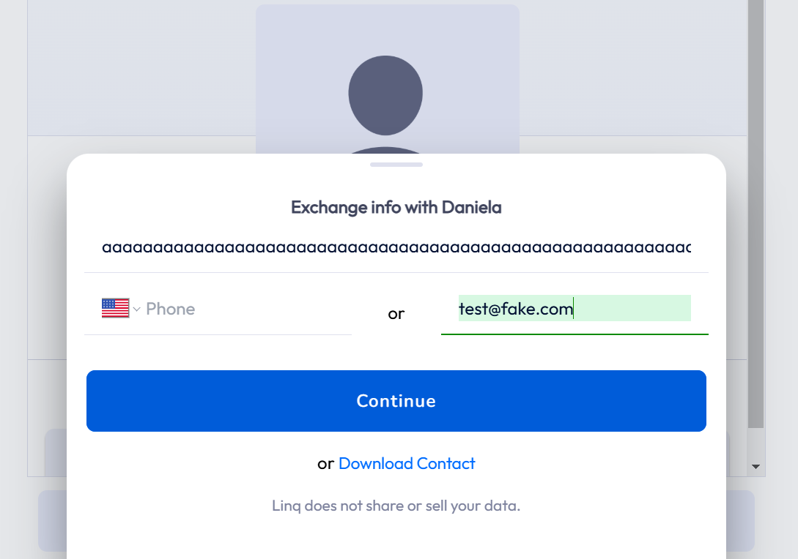
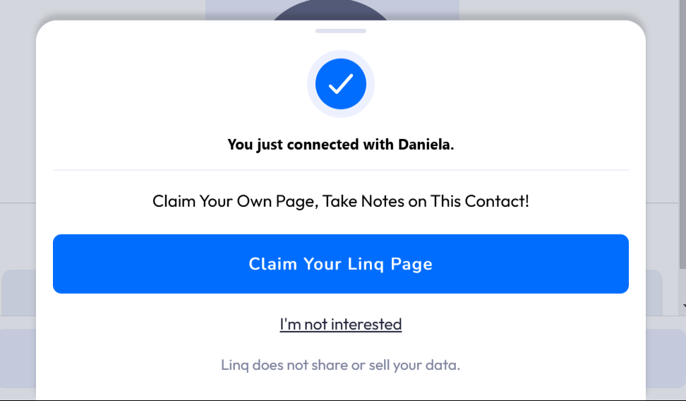
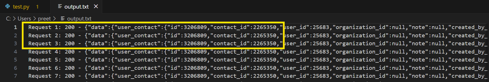
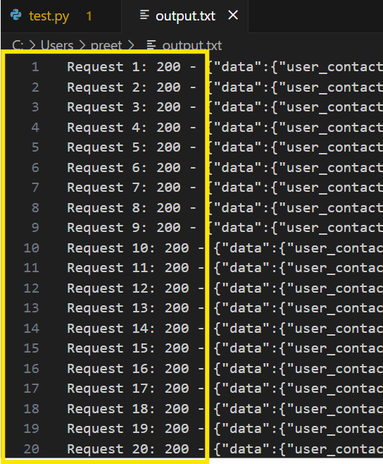
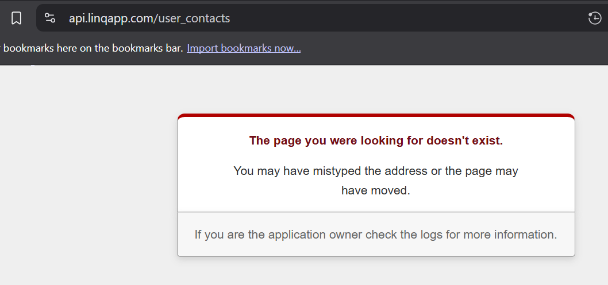

# 🐞 Bugs Report - Contact Exchange Flow (Linq)

---

## 🐛 Bug #1: No Error on Excessively Long Name Input

**Severity**: Low  
**Steps to Reproduce**:
1. Open contact exchange form
2. Enter a name with over 788 characters
3. Submit the form

**Expected Behavior**:  
Should either restrict input length or display a validation message for overly long name.

**Actual Behavior**:  
Form accepts the input without any warning or validation.

**Screenshot**:  

---

## 🐛 Bug #2: No Validation for Emojis or Non-English Characters in Name

**Severity**: Low  
**Steps to Reproduce**:
1. Enter name as `John 😊` or `محمد`
2. Submit form with valid email

**Expected Behavior**:  
Form should sanitize or validate input for edge-case characters.

**Actual Behavior**:  
No validation triggered. Form accepts and processes the name.

---

## 🐛 Bug #3: Allows Same Email to Be Submitted Repeatedly

**Severity**: Medium  
**Steps to Reproduce**:
1. Submit the form with a name and email (e.g. `test@fake.com`)
2. Submit the same exact details again multiple times

**Expected Behavior**:  
Either block duplicate submissions or show deduplication warning.

**Actual Behavior**:  
Contact is saved repeatedly without restriction or notification.

**Screenshot**:  
Request log shows identical contact being added multiple times:

---

## 🐛 Bug #4: Public Can Download Contact Info Without Verification

**Severity**: High  
**Steps to Reproduce**:
1. Open public Linq profile (e.g., `linqapp.com/daniela`)
2. Click “Download Contact”
3. Observe download prompt

**Expected Behavior**:  
Should request email verification or basic CAPTCHA before allowing download.

**Actual Behavior**:  
.vcf file is downloaded immediately without any validation.

**Screenshot**:  
_Not attached, but reproducible consistently._

---

## 🐛 Bug #5: No CAPTCHA or Bot Detection

**Severity**: Medium  
**Steps to Reproduce**:
1. Automate form submission (e.g., using Python script)
2. Run 20+ submissions rapidly

**Expected Behavior**:  
CAPTCHA or rate-limiting should be triggered to prevent abuse.

**Actual Behavior**:  
All submissions are accepted without challenge.

**Screenshot**:  
Console logs showing multiple successful submissions:

---

## 🐛 Bug #6: Endpoint Accessible Without Authentication

**Severity**: Medium  
**Steps to Reproduce**:
1. Visit: `https://api.linqapp.com/user_contacts`

**Expected Behavior**:  
Should be blocked or redirect to login.

**Actual Behavior**:  
Exposed backend returns: "Page you were looking for doesn’t exist"  
Still confirms that endpoint is public-facing.

**Screenshot**:  

_also refer to previous ScreenShot_

---

## 🐛 Bug #7: No Rate Limiting on Critical Endpoint

**Severity**: High  
**Steps to Reproduce**:
1. Hit `user_contacts` endpoint 20 times in 5 seconds using script

**Expected Behavior**:  
Rate-limiting response (e.g., 429 Too Many Requests)

**Actual Behavior**:  
All requests return `200 OK`. No throttling applied.

**Screenshot**:  

---

📌 _All bugs are verified using browser DevTools, manual form testing, and Python automation scripts._
